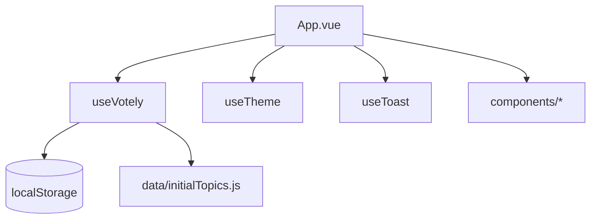

# Kiến trúc Votely

## Tổng quan

SPA client-only: không server, không database. State nằm trong bộ nhớ Vue + `localStorage`.

## Composables

### `useVotely(showToast)`

Nguồn sự thật cho:

- `topics`, `userVotes`, `userId`
- Bộ lọc: `currentCategory`, `searchQuery`, `sortBy`
- `filteredTopics` (computed)
- Vote: `handleVote` → `executeVote` → `persist()`
- Modal flags: auth / delete identity / reset all

### `useTheme()`

- `isDark`, `toggleTheme`, `initTheme`
- Gắn class `dark` trên `<html>`

### `useToast()`

- Mảng `toasts` + `showToast(message, type)`
- Types: `info` | `success` | `error`

## Components

| Component | Trách nhiệm |
|-----------|-------------|
| `AppHeader` | Logo, badge ID, xóa ID, theme toggle |
| `HeroSection` | Hero tĩnh |
| `FilterBar` | Search + category pills |
| `TopicCard` | Card 1 chủ đề + nút up/down |
| `AppFooter` | Footer + trigger reset |
| `AuthModal` | Nhập ID 9 số, Teleport |
| `ConfirmModal` | Xác nhận generic (rose/amber) |
| `ToastContainer` | Toast stack góc phải |

## Luồng vote

1. User bấm Up/Down trên `TopicCard`
2. Nếu chưa `userId` → `pendingVote` + mở `AuthModal`
3. Sau `saveIdentity` → thực hiện `pendingVote` (delay 400ms)
4. `executeVote` cập nhật counts + `userVotes`, gọi `persist()`

## Migration từ raw HTML

Bản gốc: `raw_resource/index.html` (vanilla JS, Tailwind CDN).

Vue app tái tạo cùng hành vi và cùng `localStorage` keys để user PROD không mất dữ liệu khi deploy bản mới.
